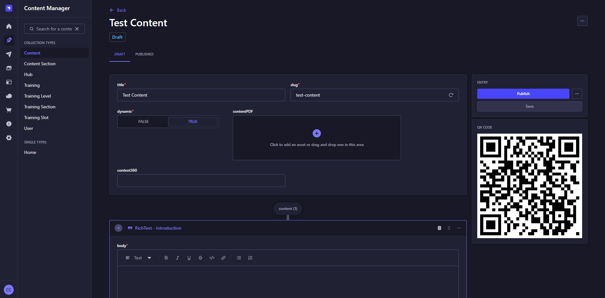

<div align="center" width="150px">
  
</div>
<div align="center">
  <h1>Strapi v5 - Plugin QR Code</h1>
  <p>Strapi Plugin to easily show QR Codes</p>
  <a href="https://www.npmjs.org/package/strapi-plugin-qr-code">
    
  </a>
  <a href="https://www.npmjs.org/package/strapi-plugin-qr-code">
    
  </a>
</div>

---

<div style="margin: 20px 0" align="center">
  
</div>

A plugin for [Strapi Headless CMS](https://github.com/strapi/strapi) that provides an easy way to show QR Codes in Strapi entities.

## Features
- Show QR Code to strapi entities on update form. This QR Code leads to computed text. 

## Usage

To configure the **QR Code** plugin, add your configuration to the plugin settings. The configuration consist of an array of contentTypes with their own computeValue function:

```typescript
type Config = {
  contentTypes: Array<{
    uid: UID.ContentType
    populate?: Array<string> | '*'
    computeValue: (
      uid: UID.ContentType, 
      status: 'draft' | 'published', 
      document: Modules.Documents.Document<UID.ContentType>
    ): string | Promise<string>;
  }>,
};
```
This configuration allows you to define a computeValue for content-types associated. The plugin try to fetch the concerned entity and pass it to computeValue function in document parameters. The string output of the function is what is used to generate the QR Code.

### Example Configuration

```typescript
// config/plugins.ts
import type { Config as QRCodeConfig } from 'strapi-plugin-qr-code/dist/server/src/config'

export default () => ({
  'qr-code': {
    enabled: true,
    config: {
      contentTypes: [
        {
          uid: 'api::content.content',
          computeValue: (uid, status, document) => {
            return `/${uid.split('.')[1]}?status=${status}&documentId=${document.documentId}`
          },
        },
        {
          uid: 'api::category.category',
          computeValue: (uid, status, document) => {
            return `My category is: ${document.name} - status: ${status} - edited: ${document.updatedDate}`
          },
        },
      ],
    } satisfies QRCodeConfig,
  }
})
```
